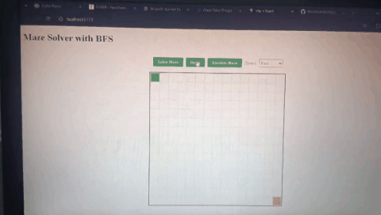

# Maze Solver with BFS Visualization

Interactive maze solver that demonstrates Breadth-First Search algorithm with step-by-step visualization.

  <!-- Add a demo gif later -->

## Features
- Interactive maze editing
- Random maze generation
- BFS algorithm visualization
- Adjustable animation speed
- Clear visual distinction between visited nodes and final path

## How to Run

### Backend (Flask)
```bash
cd backend
pip install -r requirements.txt
python app.py
```

### Frontend (React)
```bash
cd frontend
npm install
npm run dev
```

## Technologies
- Frontend: React, Tailwind CSS
- Backend: Python, Flask
- Algorithm: Breadth-First Search (BFS)
